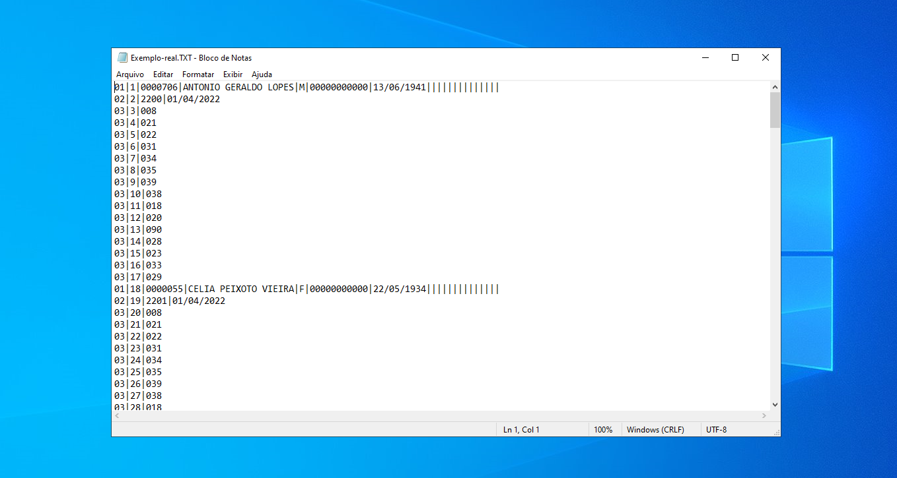
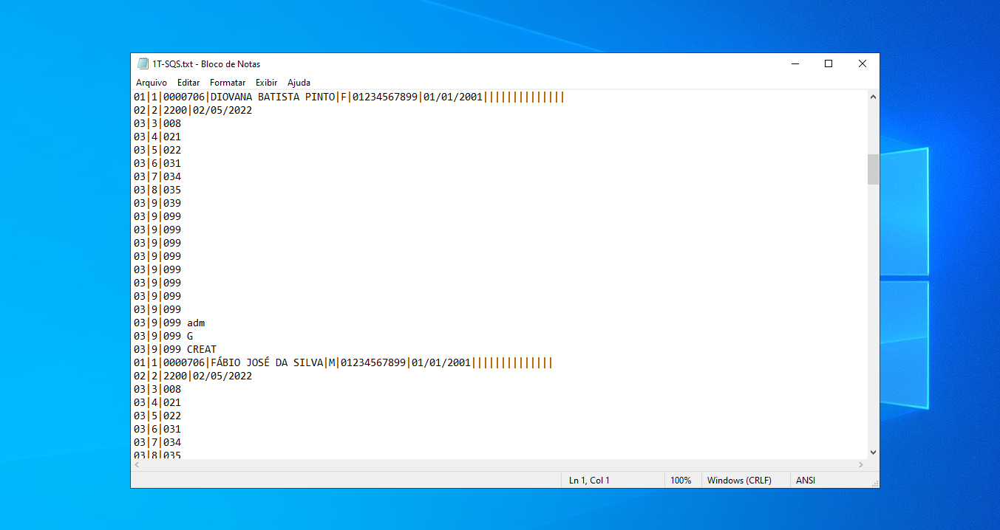

# gera-.txt-importacao

Projeto desenvolvido pela necessidade de um processo automatizado. Para contexto do problema, hoje trabalho em um laboratório que atende várias clíncas, que nos enviam arquivos de formas diferentes, entre 50 clínicas, apenas 10 enviam arquivos prontos para importacao no nosso sistema, o restante é enviado como planilha, oque leva em torno de 50min para ser conferido e incluído no sistema manualmente.
Através desse gerador de arquivo de importação a partir da planilha, o processo é automatizado e reduzido em 5min, 10x menos.

# Exemplo real de um arquivo pronto para importar no sistema

# Arquivo gerado a partir do projeto

